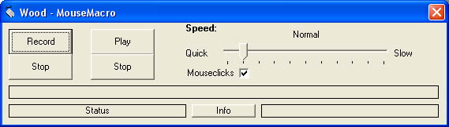

<div align="center">

## Mouse Macro


</div>

### Description

Wood - MouseMacro

This is a program for making macros in windows.

This program capture the mouse moves and clicks and play it.

You can use this code and any part of it. I would like to only ask you to add my name.

Copyright © 02/2003 SHARKSOFT, Austria

By Klemens FRIEDL

All rights reserved

Email: hotline_sharksoft@hotmail.com

Web: www.sharksoft.net.tc

DON'T FORGET TO VOTE !!
 
### More Info
 
Wood - MouseMacro

This is a program for making macros in windows.

This program capture the mouse moves and clicks and play it.


<span>             |<span>
---                |---
**Submitted On**   |2003-02-22 19:23:54
**By**             |[Klemensfr](https://github.com/Planet-Source-Code/PSCIndex/blob/master/ByAuthor/klemensfr.md)
**Level**          |Intermediate
**User Rating**    |4.3 (17 globes from 4 users)
**Compatibility**  |VB 4\.0 \(32\-bit\), VB 5\.0, VB 6\.0
**Category**       |[Windows API Call/ Explanation](https://github.com/Planet-Source-Code/PSCIndex/blob/master/ByCategory/windows-api-call-explanation__1-39.md)
**World**          |[Visual Basic](https://github.com/Planet-Source-Code/PSCIndex/blob/master/ByWorld/visual-basic.md)
**Archive File**   |[Mouse\_Macr1548672222003\.zip](https://github.com/Planet-Source-Code/klemensfr-mouse-macro__1-43435/archive/master.zip)

### API Declarations

```
Private Declare Function GetTickCount Lib "kernel32" () As Long
#If Win32 Then 'Win32 declarations
Private Declare Function GetAsyncKeyState% Lib "user32" (ByVal vKey As Long) 'Gets state of one key
Private Declare Function GetCursorPos& Lib "user32" (lpPoint As POINTAPI) 'Gets current cursor position
Private Declare Function SetCursorPos& Lib "user32" (ByVal X As Long, ByVal Y As Long) 'Sets cursor position
Private Declare Sub mouse_event Lib "user32" (ByVal dwFlags As Long, ByVal dx As Long, ByVal dy As Long, _
ByVal cButtons As Long, ByVal dwExtraInfo As Long) 'Sends a mouse event
#Else ' Win16 declarations
Private Declare Function GetAsyncKeyState% Lib "user" (ByVal vKey As Integer)
Private Declare Sub GetCursorPos Lib "user" (lpPoint As POINTAPI)
Private Declare Sub SetCursorPos Lib "user" (ByVal X As Integer, ByVal Y As Integer)
'Function mouse_event is not available in the WIN16 API.
#End If 'WIN32
```


